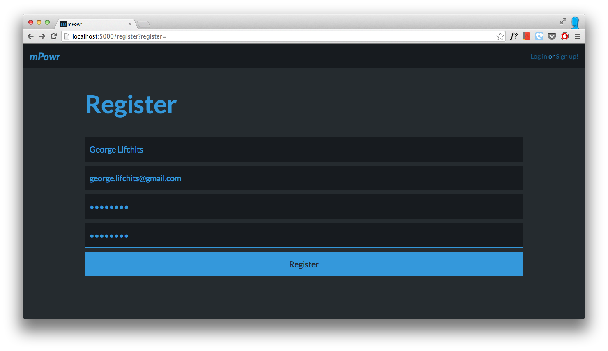
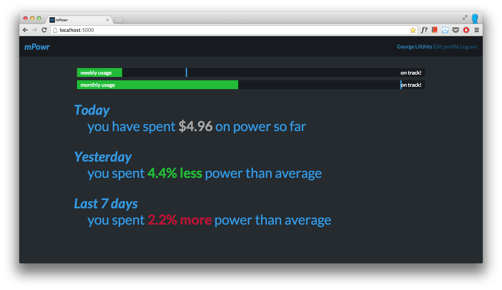
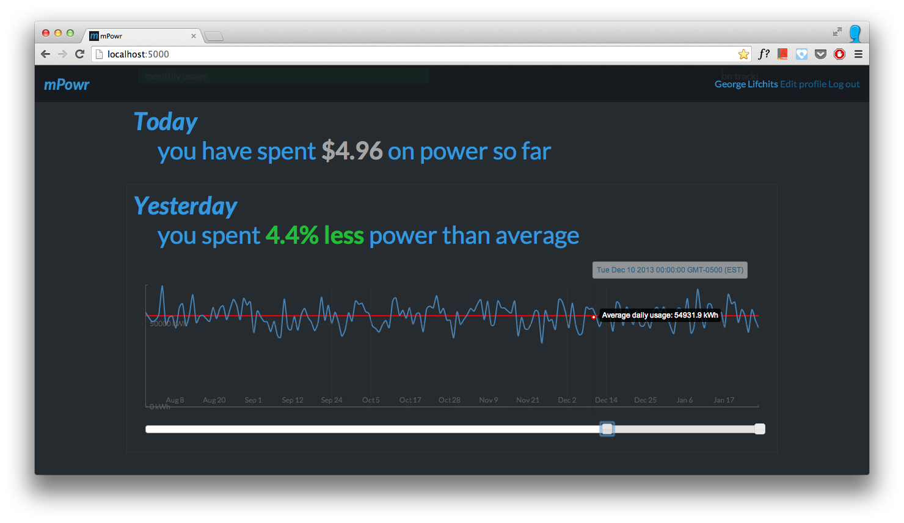
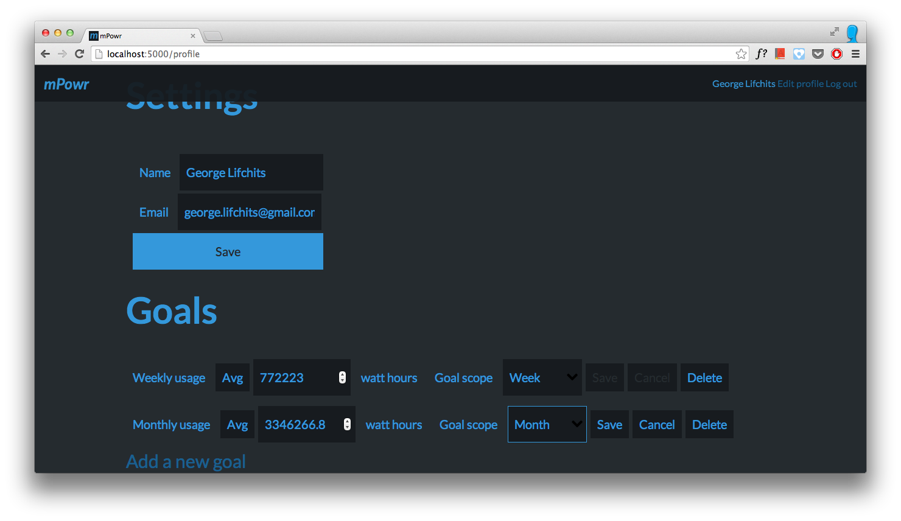

energyapps
==========

I wrote this app for a contest: unfortunate circumstances meant I couldn't meet the deadline, but it is a nearly complete
implementation (minus some polish). I used Flask to serve the data, SQLAlchemy to store it in a PostgreSQL database, and
Rickshaw.js to visualize the data.

Screenshots
-----------

Disclaimer
----------

I haven't used best practices, mostly because I was rushed to make this and also because this is a larger scale project
than I'm used to.

License
-------

Public domain.
